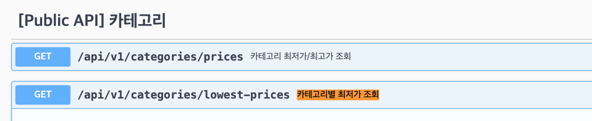
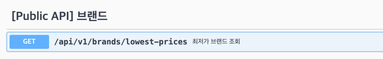
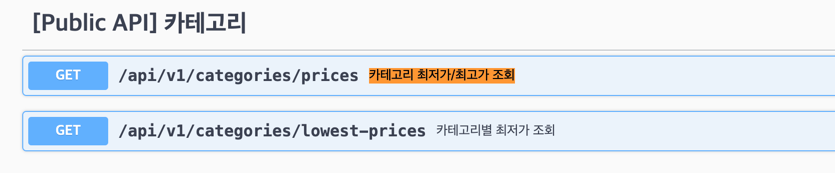
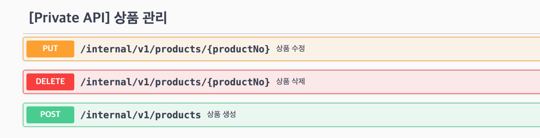
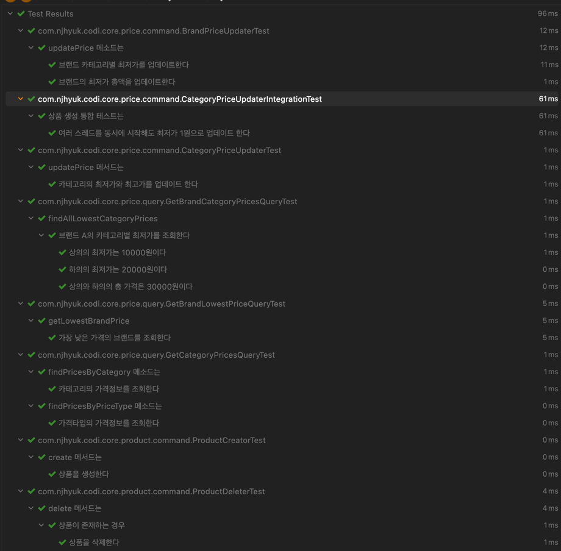

# product-api

## 프로젝트 환경 정보

```
Java 17 (17.0.4-zulu)
Gradle
Spring Boot 3.3.0
```

## 코드 빌드 및 실행

```sh
docker run -p 9200:9200 -e "discovery.type=single-node" elasticsearch:7.17.0

./gradlew clean build
```

```sh
java -jar build/libs/codi-0.0.1-SNAPSHOT.jar
```

## API 문서 (Swagger)

http://localhost:8080/swagger-ui/index.html

## 구현 범위에 대한 설명

### 구현 1

* 카테고리 별 최저가격 브랜드와 상품 가격, 총액을 조회하는 API
* `/api/v1/categories/lowest-prices`



### 구현 2

* 단일 브랜드로 모든 카테고리 상품을 구매할 때 최저가격에 판매하는 브랜드와 카테고리의 상품가격, 총액을 조회하는 API
* `/api/v1/brands/lowest-prices`



### 구현 3

* 카테고리 이름으로 최저, 최고 가격 브랜드와 상품 가격을 조회하는 API
* `/api/v1/categories/prices`



### 구현 4

* 브랜드 및 상품을 추가 / 업데이트 / 삭제하는 API
* `/internal/v1/products`



### 단위테스트 및 통합테스트

```
./gradlew clean test
```



## 접근/해결 방식

* 서브쿼리 및 집계 쿼리를 사용할 것인가?
    * 브랜드별 최저가, 카테고리별 최저가를 구현하기 위해 서브쿼리 및 집계 쿼리를 사용하는 경우, 대규모 트래픽 환경에서 감당하기 어려운 쿼리 성능 문제가 발생할 수 있음
    * 이를 해결하기 위해 상품이 추가/수정/삭제될 때마다 최저가 정보를 업데이트하는 방식으로 구현함 (Event Driven Architecture/Event Sourcing)
    * 상품 추가/수정/삭제 ProductEvent 를 발행함
    * 이벤트를 수신하는 ProductEventConsumer 를 통해 최저가 정보를 업데이트함
        * CategoryPriceUpdater : 카테고리별 최저가 정보 업데이트
        * BrandPriceUpdater : 브랜드별 최저가 정보 업데이트
* 아키텍처는 어떻게 구성 할 것인가?
    * 계층형 아키텍처 채택, 헥사고날의 일부 개념 적용 inbound (웹, 이벤트 구독자), outbound (이벤트 발행자)
    * 최소한의 메소드만 갖는 Command (저장/실행), Query (조회) 객체로 구성하여 SRP를 따르려 노력함
        * GetCategoryPricesQuery : 카테고리별 최저가 "조회" 책임
        * CategoryPriceUpdater : 카테고리별 최저가 정보 "업데이트" 책임
* 동시성 이슈는 어떻게 처리할 것인가?
    * 이벤트 소싱 방식으로 최저가 업데이트시 동시성 이슈가 발생할 수 있음
    * @RedisDistributedLock 어노테이션을 통해 CategoryPriceUpdater 및 BrandPriceUpdater 에 대한 동시성 제어를 수행함
    * 동시성 통합테스트는 CategoryPriceUpdaterIntegrationTest 에서 수행함

## 스키마 정보

### 테이블: product

| 컬럼명     | 데이터 타입         | 설명                       |
|------------|---------------------|----------------------------|
| id         | BIGINT              | 기본 키, 자동 생성          |
| price      | INT              | 상품의 가격                 |
| category   | VARCHAR             | 상품의 카테고리              |
| brand      | VARCHAR             | 상품의 브랜드               |
| created_at | DATETIME           | 생성 일시                  |
| updated_at | DATETIME           | 수정 일시                  |

### 인덱스

| 인덱스명           | 컬럼 리스트                    |
|--------------------|--------------------------------|
| product_idx01      | category, brand, price         |

### 코멘트

- `product` 테이블은 상품의 기본 정보를 저장함
- `product_idx01` 인덱스는 카테고리 및 브랜드별 최저가 정보를 조회하기 위한 인덱스임

### 테이블: brand_category_lowest_price

| 컬럼명         | 데이터 타입        | 설명                           |
|----------------|---------------|--------------------------------|
| id             | BIGINT        | 기본 키, 자동 생성              |
| brand          | VARCHAR       | 브랜드                         |
| category       | VARCHAR       | 카테고리                        |
| product_no     | BIGINT        | 상품 번호                       |
| product_price  | INT        | 상품 가격                       |
| created_at     | DATETIME      | 생성 일시                       |
| updated_at     | DATETIME      | 수정 일시                       |

### 고유 제약 조건

| 컬럼 리스트            |
|------------------------|
| brand, category        |

### 코멘트

`brand_category_lowest_price` 테이블은 브랜드*카테고리별 최저가를 저장함 (최저가 브랜드 조회 API에 사용됨)

### 테이블: brand_lowest_price

| 컬럼명         | 데이터 타입       | 설명                          |
|----------------|--------------|-------------------------------|
| id             | BIGINT       | 기본 키, 자동 생성             |
| brand          | VARCHAR      | 브랜드                        |
| total_price    | INT       | 총 가격                       |
| created_at     | DATETIME     | 생성 일시                      |
| updated_at     | DATETIME     | 수정 일시                      |

### 고유 제약 조건

| 컬럼 리스트            |
|------------------------|
| brand                  |

### 인덱스

| 인덱스명                   | 컬럼 리스트    |
|----------------------------|----------------|
| brand_lowest_price_idx01   | brand          |
| brand_lowest_price_idx02   | total_price    |

#### 코멘트

`brand_lowest_price` 테이블은 브랜드별로 최저가 코디세트 총액을 저장함 (최저가 브랜드 조회 API에 사용됨)

### 테이블: category_price

| 컬럼명         | 데이터 타입         | 설명                           |
|----------------|---------------------|--------------------------------|
| id             | BIGINT              | 기본 키, 자동 생성              |
| price_type     | VARCHAR             | 가격 타입                      |
| category       | VARCHAR             | 카테고리                        |
| brand          | VARCHAR             | 브랜드                         |
| product_no     | BIGINT              | 상품 번호                       |
| product_price  | INT              | 상품 가격                       |
| created_at     | DATETIME           | 생성 일시                       |
| updated_at     | DATETIME           | 수정 일시                       |

### 고유 제약 조건

| 컬럼 리스트                 |
|-----------------------------|
| price_type, category        |

### 인덱스

| 인덱스명              | 컬럼 리스트                        |
|-----------------------|------------------------------------|
| category_price_idx01  | price_type, category, product_price|

### 코멘트

- `category_price` 테이블은 카테고리별 가격정보를 저장함 (price_type 타입에 따라 최저가/최고가를 저장함)
- 카테고리별 최저가 조회 API와, 카테고리 이름으로 최저, 최고 가격 브랜드와 상품 가격을 조회하는 API에 사용됨
